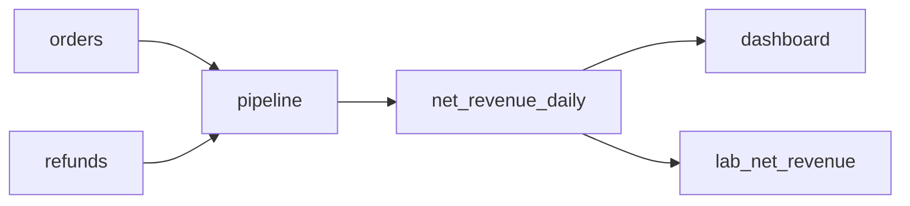

# OpenMetadata Learning Lab

**지표의 정의·소유자·원천을 따라가며, 등록한 관계와 아직 모르는 관계를 구분하는 실험**입니다.
OpenMetadata 자체를 개발한 프로젝트가 아닙니다. 기존 제품 위에서 합성 매출 자료의 메타데이터를 API로 등록하고,
저장된 관계를 다시 읽어 기대값과 대조하는 Python 도구와 검사입니다.

대상은 OpenMetadata 2.0.1, 소스 revision
[`bf621b1`](https://github.com/open-metadata/OpenMetadata/tree/bf621b166ec12e8c99fcb1c1443442723386fa41)입니다.
업스트림 서버·화면 코드·컨테이너·실행 중 DB는 이 저장소에 포함하지 않습니다.

## 서버 없이 읽고 실행하기

Python 3 표준 라이브러리만 씁니다. 기본 명령은 요청을 보내지 않는 dry-run입니다.

```bash
python3 compose/seed/seed_first_scene.py       # 등록 계획만 출력
python3 compose/seed/test_verify_stub.py       # 가짜 API를 쓰는 14개 시나리오
```

파일은 네 개입니다.

| 파일 | 역할 |
|---|---|
| [seed_first_scene.py](compose/seed/seed_first_scene.py) | 개체·간선 등록, 개별 간선 조회, 기대값 대조 |
| [expected-graph.json](compose/seed/expected-graph.json) | 합성 장면의 개체·관계·계산 기대값 |
| [edge-context.json](compose/seed/edge-context.json) | 간선의 의미·작성 출처·확인 범위·예시 SQL |
| [test_verify_stub.py](compose/seed/test_verify_stub.py) | 간선 누락·다른 소유자·응답 모양·기존 설명 보존의 반례 |

## 한 숫자에서 출발하는 장면

한 주문의 매출이 100, 그 주문의 환불이 20과 10이면 이 사례의 순매출은 **70**입니다.
이는 하루치 합성 계산 예시입니다. 지표 정의는 "총매출에서 환불을 뺀다"는 규칙이며 70 자체가 정의는 아닙니다.
환불은 원래 주문 날짜에 귀속시키기로 했습니다. 이 선택은 실험의 규칙이며 일반 회계 규칙을 뜻하지 않습니다.



여기에 용어·지표 정의와 소유자 참조를 붙입니다. OpenMetadata의 Lineage 화면에서는 지표에서 원천을 따라가고,
연결선을 눌러 설명을 읽습니다. 개발 환경에서는 `Fit to screen` → 연결선 클릭 → `Show More` 순서로 출처와 범위를 확인했습니다.
`pipeline → net_revenue_daily` 간선에만 설계 SQL이 있으며, 나머지 간선에 SQL이 없는 것은 미실행 상태를 반영합니다.

**이 다섯 관계는 AI가 실험용으로 작성해 API로 등록한 합성 관계입니다.** 제품이 실제 DB나 파이프라인에서 찾아낸 관계가 아닙니다.
UI의 `Manual`은 여기서 자동 수집이 아닌 API 등록을 뜻하며, 사람이 작성·감수했다는 증거가 아닙니다.
등록하지 않은 관계는 "영향 없음"이 아니라 이 실험에서 **미확인**입니다.

## AI와 함께 어떤 판단을 고쳤나

사람이 온톨로지·메타데이터 제품을 학습하고 포트폴리오로 설명할 목적과 실행 범위를 정했습니다.
Claude Code가 고정한 업스트림 소스를 읽고 fixture·검사를 작성했으며, Codex 총괄이 반환과 실제 API 응답을 대조하고
허용된 로컬 실험의 등록·저장 재조회·화면 검수를 맡았습니다.

- **같은 가정으로 만든 검사도 틀릴 수 있습니다.** 첫 간선 파서는 응답의 `edge.lineageDetails`를 찾았습니다.
  실제 응답은 `edge` 자체가 details였는데, 키가 없다는 이유로 기존 내용이 없다고 판단했습니다.
  실응답 모양을 검사에 넣어 빈 내용/기존 설명/알 수 없는 모양을 나누고, 기존 내용이 있거나 판독할 수 없으면 쓰기 전에 중단하도록 고쳤습니다.
- **관계가 저장되어도 화면이 그 관계를 읽는지 확인해야 합니다.** 지표의 `assets` 연결만으로는 Metric Lineage 탭에서 원천이 보이지 않았습니다.
  화면이 소비하는 lineage 간선을 별도로 등록하고 실제 탭을 대조했습니다.
- **SQL과 기대값을 함께 의심했습니다.** 주문과 환불을 그대로 조인하면 한 주문의 매출을 두 번 더해 170이 나옵니다.
  환불을 주문별로 먼저 합쳐 1:1로 조인하도록 바꿔 독립적으로 정한 기대값 70에 맞췄습니다.

## 확인한 범위

개발 당시 로컬 서버에서 개체 13개·간선 5개의 그래프 대조 **41 MATCH**와 간선 상세의
출처 5개·설명 5개·SQL 1개 대조 **11 MATCH**를 별도로 확인했습니다.
그래프가 맞는 것과 설명이 저장된 것은 같은 검사가 아닙니다.
이 공개 사본에서 재현한 것은 서버 없는 dry-run과 14개 stub 시나리오입니다.
**새 서버 전체 복원, 자동 추론, 실제 기업 권한, 영향 범위의 완전성, 사용자의 이해는 검증하지 않았습니다.**

검증 종료코드는 `0` 일치, `1` 불일치, `2` 미확인 잔여입니다. 미확인을 성공이나 영향 없음으로 바꾸지 않습니다.

## 실제 서버에 연결하는 경계

서버 설치·기동은 이 공개 사본의 재현 명령에 포함하지 않습니다. 별도로 마련한 격리된 OpenMetadata 2.0.1 실험 인스턴스에서만
대상·기존 내용·계정을 확인한 뒤 연결해야 합니다. 로그인 비밀번호는 `OM_PASSWORD` 환경변수로 읽고 명령 인자에 넣지 않습니다.
`--verify-only`도 로그인과 조회 요청을 보내며, `--apply`는 쓰기를 수행합니다.

`PUT`은 생성뿐 아니라 갱신도 하므로 같은 `lab_` 이름의 기존 자료를 바꿀 수 있습니다.
`guard()`가 모든 쓰기를 강제하는 구조는 아니며 간선의 대상은 검토된 JSON에서 옵니다.
기존 내용이 있는 다섯 간선의 맥락을 무조건 다시 적용해서는 안 됩니다.
개발 환경에서 사용한 별도 요청 제한·복원 전 자료는 이 사본에 포함하지 않았습니다.

## 자료와 코드

[OpenMetadata](https://github.com/open-metadata/OpenMetadata)는 별도 업스트림 제품입니다.
여기에는 업스트림 코드나 화면 자산을 복사하지 않았으며, 합성 fixture와 API 클라이언트·검사를 AI와 함께 작성했습니다.
자체 코드에는 별도 공개 라이선스를 부여하지 않았습니다.
